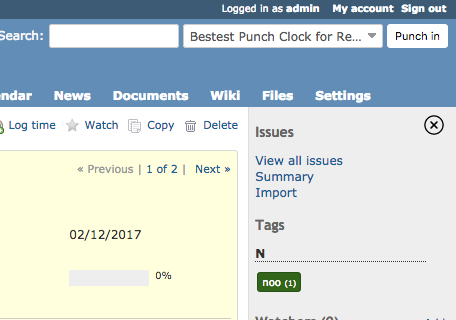
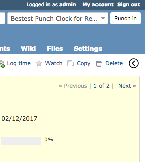

# Bestest Side-Bar Annihilator for Redmine

This plugin adds a button that hides or shows Redmine's side-bar. No per-view/per-controller state, no `z-index` hacks
that interferes with fullscreen views, no nonsense. When it's hidden, it stays hidden until you chose to show it again.

Simple!

| On                              | Off                              |
| :-----------------------------: | :------------------------------: |
|  |  |

## Installation

`cd` into the `redmine/plugins` folder and run:

```bash
git clone https://github.com/LeviticusMB/bestest_sidebar_annihilator.git
```

## Upgrade to latest stable release

`cd` into the `redmine/plugins` folder and run:

```bash
git pull
```

## Branches/major releases

### `master`

The `master` branch tracks the latest stable release.

### `v1.0` (2018-07-25)

Initial release branch.
